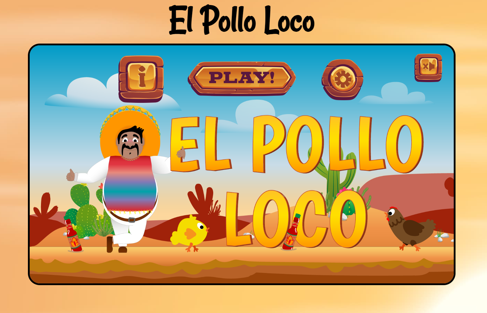

# El Pollo Loco

A browser-based 2D jump-and-run game built with vanilla JavaScript and the HTML5 Canvas API — no frameworks, no game engine, no build step.

**[▶ Play it here](https://wanjamueller.developerakademie.net/el_pollo_loco/index.html)**



---

## About

Help Pepe cross the desert, collect coins and salsa bottles, fight off the chickens and take down the crazy chicken boss at the end of the level. The whole game — sprite animation, physics, collision detection, sound, and a responsive touch UI — is drawn frame by frame onto a single 720×480 canvas element.

Built as a portfolio project during the Developer Akademie full-stack bootcamp.

## Features

- **Object-oriented architecture** — a class hierarchy shared by every drawable thing in the game
- **Frame-based sprite animation** with state-driven animation selection (idle, long idle, walking, jumping, hurt, dead)
- **Gravity and jump physics** with ground clamping
- **Collision detection** using per-object hitboxes with configurable offsets
- **Directional stomp detection** — landing on a chicken kills it, walking into one costs health
- **Throwable bottles** that arc in the direction Pepe is facing and splash on impact
- **Endboss AI** with alert, approach, attack, hurt, and death states
- **Four status bars** fixed to the viewport while the world scrolls behind them
- **Full audio system** with per-sound retrigger control and a mute state saved to local storage
- **Responsive layout** with on-screen touch controls, fullscreen support, and a rotate prompt in portrait
- **Fully documented** with JSDoc

## Controls

| Input | Action |
|---|---|
| `←` `→` | Move left / right |
| `Space` | Jump |
| `D` | Throw a bottle |

On touch devices, on-screen buttons appear automatically.

## Tech stack

- **JavaScript (ES6+)** — classes, inheritance, modules, arrow functions
- **HTML5 Canvas API** — `drawImage`, transforms, `requestAnimationFrame`
- **CSS3** — flexbox, nesting, `clamp()`, media queries for pointer type and orientation
- **Web APIs** — Audio, Local Storage, Fullscreen, Touch Events
- **JSDoc** — generated API documentation

No dependencies. No bundler. Everything runs from static files.

## Project structure

```
├── index.html
├── style.css
├── js/
│   ├── game.js              # entry point, menu and UI wiring
│   └── templates.js         # HTML templates for the controls dialog
├── models/
│   ├── drawable-objects.class.js    # base class: images, drawing, hitboxes
│   ├── movable-object.class.js      # gravity, collisions, animation, health
│   ├── character.class.js           # the player
│   ├── chicken.class.js             # standard enemy
│   ├── chicken-small.class.js       # smaller, faster enemy
│   ├── endboss.class.js             # final enemy with attack states
│   ├── throwable-object.class.js    # salsa bottles in flight
│   ├── world.class.js               # game loop, camera, all collision checks
│   ├── level.class.js
│   ├── image-hub.class.js           # every image path in one place
│   ├── AudioHub.class.js            # every sound in one place
│   └── intervallhub.class.js        # central interval registry
├── levels/
│   └── level1.js            # level factory
└── assets/                  # images, audio, icons
```

## Technical highlights

A few problems that were more interesting than they first looked:

**Camera framing across the boss fight.** The camera normally keeps Pepe 100px from the left edge. Once he moves past the endboss, the framing flips so the boss stays in view behind him. Rather than easing between the two positions — which made the background visibly slide — the camera holds still and lets Pepe walk across the screen to his new position. A single lock flag and a pair of `Math.min` / `Math.max` clamps handle both directions symmetrically, and the result is rounded to whole pixels so the parallax layers never separate.

**Interval management.** Every animated object starts its own intervals. Left alone, thrown bottles and dead chickens keep ticking long after they leave the screen, which showed up as a steady frame-rate decline on mobile. Interval IDs are now registered per object and cleared when the object is removed, alongside a central registry that stops everything at once on game over.

**Level rebuilding.** The level started life as a module-level singleton, which meant a second playthrough reused dead enemies and stale positions. It is now built by a factory function, so every restart gets fresh objects — which in turn required removing static counters that were quietly holding state between games.

**Draw order from data.** The parallax background is generated by looping over the image hub rather than instantiating 24 objects by hand. The order of the keys in the hub *is* the draw order, so adding a layer is a one-line change in a single file.

## Running locally

Clone the repository and serve it over HTTP — ES modules will not load from `file://`.

```bash
git clone https://github.com/YOUR-USERNAME/el-pollo-loco.git
cd el-pollo-loco
npx serve
```

Then open the URL that `serve` prints. Any static server works; VS Code's Live Server extension is fine too.

## Documentation

API documentation is generated with JSDoc:

```bash
npm install -g jsdoc
jsdoc -c jsdoc.json
```

The output lands in `out/` — open `out/index.html` in a browser.

## Credits

Graphics and audio assets provided by [Developer Akademie](https://developerakademie.com). Code written by me.

---

Built by **Wanja Müller** — [GitHub](https://github.com/YOUR-USERNAME) · [LinkedIn](https://linkedin.com/in/YOUR-PROFILE)
